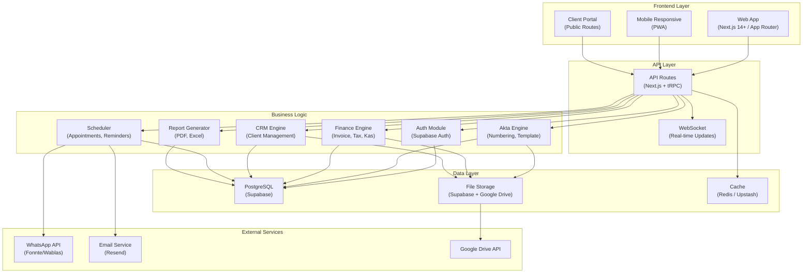
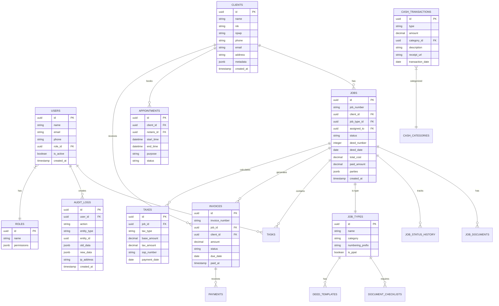
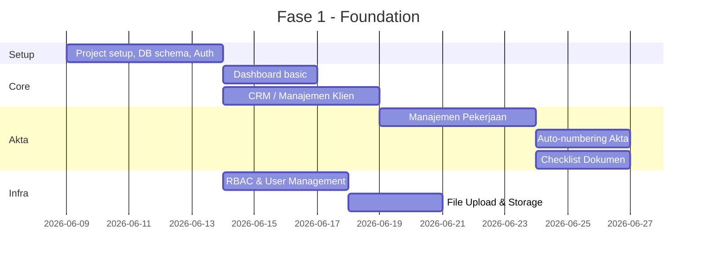

# 🏗️ Implementation Plan — NotarisPro Web Application
## Sistem Manajemen Kantor Notaris & PPAT Terintegrasi

> **Versi:** 1.0  
> **Tanggal:** 1 Juni 2026  
> **Dasar:** Hasil Diskusi Panel 5 Kepala Divisi (lihat [workflow.md](file:///c:/Users/Han/Desktop/project%20notaris/workflow.md))

---

## 1. Ringkasan Proyek

### 1.1 Masalah yang Diselesaikan
Kantor notaris menghadapi 30+ pain point operasional yang teridentifikasi dari 5 divisi:
- **Administrasi:** Penomoran manual, template tidak standar, repertorium fisik, laporan manual
- **Keuangan:** Invoice Excel, piutang tak terlacak, pajak manual, pembukuan tidak terpusat
- **Layanan Klien:** Jadwal berantakan, klien buta progres, tidak ada CRM, follow-up terlewat
- **IT:** Data tersebar, keamanan minim, tidak ada audit trail, backup manual
- **SDM:** Beban tidak merata, KPI subjektif, knowledge management buruk

### 1.2 Solusi
Membangun **NotarisPro** — web application terintegrasi yang mencakup 10 modul utama dengan 55+ fitur, dirancang khusus untuk kantor Notaris & PPAT Indonesia.

### 1.3 Diferensiasi dari Kompetitor

| Aspek | NotarisApp.id | Notaria.id | **NotarisPro (Kita)** |
|-------|:---:|:---:|:---:|
| Janji Temu Online | ❌ | ❌ | ✅ |
| Client Portal Advanced | ❌ | ❌ | ✅ |
| Full CRM | ❌ | ❌ | ✅ |
| Pembukuan Lengkap | ❌ | ❌ | ✅ |
| WhatsApp Auto-Notification | ❌ | ❌ | ✅ |
| Template Akta Library | ❌ | ❌ | ✅ |
| Task Management & KPI | ❌ | ❌ | ✅ |
| Full Audit Trail | ❌ | ✅ | ✅ |
| Approval Workflow | ❌ | ✅ | ✅ |
| Google Drive Integration | ✅ | ❌ | ✅ |
| Kalkulator Pajak | ✅ | ❌ | ✅ (Advanced) |
| Laporan Bulanan | ✅ | ❌ | ✅ (Advanced) |
| Access Levels | 2 level | Role-based | 5+ level granular |

---

## 2. Arsitektur Sistem

### 2.1 Diagram Arsitektur

### 2.2 Tech Stack

| Layer | Teknologi | Alasan |
|-------|-----------|--------|
| **Framework** | Next.js 14+ (App Router) | SSR/SSG, file-based routing, API routes built-in |
| **Language** | TypeScript | Type safety, better DX, fewer runtime errors |
| **Styling** | Tailwind CSS + shadcn/ui | Rapid development, consistent design system |
| **State Management** | Zustand + TanStack Query | Lightweight, server-state caching |
| **API** | tRPC | End-to-end typesafe APIs |
| **Database** | PostgreSQL (Supabase) | Robust, free tier, real-time subscriptions |
| **ORM** | Prisma | Schema-first, migrations, type generation |
| **Auth** | Supabase Auth + NextAuth.js | Google SSO, RBAC, session management |
| **Storage** | Supabase Storage + Google Drive API | Dual strategy: DB files + client-facing Drive |
| **WhatsApp** | Fonnte.com API | WhatsApp gateway lokal Indonesia, murah |
| **Email** | Resend | Modern email API, React Email templates |
| **PDF** | React-PDF / @react-pdf/renderer | Laporan bulanan, invoice, tanda terima |
| **Excel** | SheetJS (xlsx) | Export data ke spreadsheet |
| **Charts** | Recharts | Dashboard analytics & grafik |
| **Deployment** | Vercel | Zero-config, edge functions, auto-scaling |
| **Monitoring** | Sentry + Vercel Analytics | Error tracking, performance monitoring |

### 2.3 Database Schema (Simplified ERD)

---

## 3. Modul-Modul Utama

### Modul 1: 🏠 Dashboard & Analytics
**Tujuan:** Memberikan overview real-time seluruh operasi kantor

**Fitur:**
- Widget statistik: jumlah akta bulan ini, pekerjaan aktif, piutang outstanding, appointment hari ini
- Grafik pendapatan bulanan (line chart)
- Status pekerjaan breakdown (pie chart)
- Reminder & notifikasi terpusat
- Quick actions: tambah klien, buat pekerjaan, buat appointment

**Tampilan per role:**
| Widget | Notaris | Admin | Staf | Keuangan |
|--------|---------|-------|------|----------|
| Revenue overview | ✅ | ❌ | ❌ | ✅ |
| Pekerjaan aktif | ✅ | ✅ | ✅ (milik sendiri) | ❌ |
| Piutang | ✅ | ❌ | ❌ | ✅ |
| Appointment | ✅ | ✅ | ✅ | ❌ |
| KPI staf | ✅ | ✅ | ❌ | ❌ |

---

### Modul 2: 👥 Manajemen Klien (CRM)
**Tujuan:** Single source of truth untuk semua data klien

**Fitur:**
- Database klien: nama, NIK, NPWP, alamat, telepon, email
- Riwayat pekerjaan per klien
- Riwayat pembayaran per klien
- Catatan/notes per interaksi
- Tag & kategori klien (VIP, korporat, individu)
- Quick search & filter
- Merge duplicate klien

---

### Modul 3: 📄 Manajemen Akta & Pekerjaan
**Tujuan:** Lifecycle management dari intake hingga arsip

**Fitur:**
- Buat pekerjaan baru → pilih jenis → auto-load checklist
- Auto-numbering akta (terpisah Notaris/PPAT)
- Status pipeline: Draft → Review → Approved → Signing → BPN → Done
- Auto-fill data klien dari CRM
- Upload & manage dokumen per pekerjaan
- Assignment staf (manual/auto-balance)
- Timeline & history per pekerjaan
- Tabel terpisah: Akta Notaris vs Akta PPAT

---

### Modul 4: 📚 Repertorium & Laporan
**Tujuan:** Otomatisasi pencatatan repertorium dan pelaporan bulanan

**Fitur:**
- Repertorium digital auto-populated dari data akta
- Pencatatan legalisasi & waarmerking
- Auto-generate laporan bulanan:
  - Laporan Akta Notaris (A4, format standar)
  - Laporan PPAT (A3, font mesin ketik vintage)
  - Laporan Legalisasi & Waarmerking
- Export PDF siap cetak
- Filter per periode, per jenis
- Sesuai format Peraturan Menteri ATR/BPN

---

### Modul 5: 💰 Keuangan & Pajak
**Tujuan:** Full financial management untuk kantor notaris

**Sub-modul:**

#### 5a. Invoice & Pembayaran
- Invoice generator (branded, custom template)
- Auto-calculate dari data pekerjaan
- Kirim invoice via WhatsApp/Email
- Payment tracking (DP, cicilan, lunas)
- Tanda terima digital dengan QR code
- Dashboard piutang & aging analysis

#### 5b. Kalkulator Pajak
- BPHTB: 5% × (NPOP - NPOPTKP), NPOPTKP per daerah bisa di-setting
- PPh Final: 2.5% × NPOP
- PPN (jika applicable)
- Honorarium sesuai Pasal 36 UUJN
- History perhitungan

#### 5c. Kas Masuk/Keluar
- Pencatatan pemasukan & pengeluaran operasional
- Kategorisasi (ATK, transport, materai, dll)
- Upload bukti transaksi
- Saldo kas real-time
- Laporan kas harian/bulanan

#### 5d. Laporan Keuangan
- Dashboard P&L sederhana
- Revenue per jenis pekerjaan
- Revenue per bulan (trend)
- Total pajak yang telah dibayarkan
- Export Excel

---

### Modul 6: 📅 Penjadwalan & Komunikasi
**Tujuan:** Manajemen janji temu dan komunikasi klien

**Fitur:**
- Calendar view (hari/minggu/bulan)
- Online booking link (shareable)
- Slot availability management
- Auto-send checklist dokumen sebelum appointment
- Konfirmasi & reminder otomatis (H-1, H-3)
- Reschedule/cancel workflow
- Conflict detection (anti double-booking)
- WhatsApp notification terintegrasi

---

### Modul 7: 📁 Manajemen Dokumen
**Tujuan:** Centralized, secure document management

**Fitur:**
- Upload & organize dokumen per pekerjaan
- Dynamic checklist per jenis akta
- Template library akta (variabel dinamis)
- Document versioning (revision history)
- Cloud storage (Supabase + Google Drive sync)
- Full-text search
- Preview dokumen (PDF, gambar)
- Bulk download

---

### Modul 8: 👨‍💼 SDM & Task Management
**Tujuan:** Optimalisasi sumber daya manusia

**Fitur:**
- Task assignment per pekerjaan
- Workload dashboard (visual: siapa handle berapa pekerjaan)
- KPI tracking:
  - Jumlah akta diselesaikan
  - Rata-rata waktu penyelesaian
  - Tingkat revisi/error
- Activity log per staf
- Notifikasi task baru

---

### Modul 9: 🌐 Portal Klien
**Tujuan:** Self-service portal untuk klien

**Fitur:**
- Unique link per klien (no login required) ATAU login-based
- Cek status/progres pekerjaan real-time
- Upload dokumen yang diminta
- Download dokumen yang sudah selesai
- Lihat invoice & status pembayaran
- Riwayat pekerjaan sebelumnya

---

### Modul 10: ⚙️ Administrasi Sistem
**Tujuan:** Security, compliance, dan konfigurasi

**Fitur:**
- User management (CRUD users)
- Role-based access control (Notaris, Kepala Divisi, Staf Senior, Staf Junior, Keuangan)
- Audit trail (siapa, apa, kapan, IP)
- Konfigurasi kantor (nama, alamat, logo, nomor SK)
- Konfigurasi NPOPTKP per daerah
- Konfigurasi jenis pekerjaan & checklist
- Backup management
- Data retention settings

---

## 4. Roadmap Implementasi

### Fase 1: Foundation (Minggu 1-4)
> **Goal:** MVP internal — staf bisa mulai input data dan Notaris bisa monitor

**Deliverables:**
- [x] Project setup (Next.js + Supabase + Prisma)
- [ ] Authentication & RBAC (5 roles)
- [ ] Dashboard utama (basic widgets)
- [ ] CRM: CRUD klien + search
- [ ] Manajemen Pekerjaan: CRUD + pipeline status
- [ ] Auto-numbering akta (Notaris & PPAT)
- [ ] Checklist dokumen per jenis
- [ ] File upload ke Supabase Storage
- [ ] Responsive mobile layout

---

### Fase 2: Finance & Reporting (Minggu 5-8)
> **Goal:** Sistem keuangan dan pelaporan berjalan — kantor bisa tutup buku digital

**Deliverables:**
- [ ] Invoice generator (auto-calculate)
- [ ] Payment tracking (DP, cicilan, lunas)
- [ ] Kalkulator BPHTB & PPh
- [ ] Kas masuk/keluar
- [ ] Dashboard piutang
- [ ] Repertorium digital (auto-populated)
- [ ] Laporan bulanan Notaris (PDF A4)
- [ ] Laporan bulanan PPAT (PDF A3, font mesin ketik)
- [ ] Pencatatan legalisasi & waarmerking
- [ ] Smart Search (full-text)
- [ ] Export Excel
- [ ] Audit trail dasar

---

### Fase 3: Client-Facing (Minggu 9-12)
> **Goal:** Klien bisa booking dan tracking mandiri — mengurangi beban staf

**Deliverables:**
- [ ] Booking janji temu online (public link)
- [ ] Calendar management
- [ ] Client portal (status tracking)
- [ ] Client portal: upload & download dokumen
- [ ] WhatsApp integration (notifikasi otomatis)
- [ ] Payment reminder otomatis
- [ ] Template akta library (variabel dinamis)
- [ ] Document versioning
- [ ] Tanda terima digital (QR code)
- [ ] Honorarium calculator (Pasal 36)

---

### Fase 4: Advanced (Minggu 13-16)
> **Goal:** Full feature — semua modul berjalan, optimasi & polish

**Deliverables:**
- [ ] Task assignment & workload dashboard
- [ ] KPI tracking per staf
- [ ] Approval workflow digital (Notaris)
- [ ] Proses BPN tracking
- [ ] Dashboard analytics advanced (charts, trends)
- [ ] Laporan keuangan (P&L sederhana)
- [ ] Notification center terpusat
- [ ] Google Drive sync integration
- [ ] PWA support (install di HP)
- [ ] Performance optimization & security hardening

---

## 5. Estimasi Effort & Resources

### 5.1 Tim Development

| Role | Jumlah | Skill |
|------|--------|-------|
| Full-stack Developer (Lead) | 1 | Next.js, TypeScript, Supabase, Prisma |
| Full-stack Developer | 1-2 | Next.js, TypeScript, React |
| UI/UX Designer | 1 | Figma, design system |
| QA / Tester | 1 | Manual + automated testing |

### 5.2 Estimasi Biaya Infrastruktur (Monthly)

| Service | Tier | Biaya/bulan |
|---------|------|-------------|
| Vercel | Pro | $20 |
| Supabase | Pro | $25 |
| Fonnte WhatsApp API | Starter | Rp 50.000 |
| Resend Email | Free (100/day) | $0 |
| Domain + SSL | - | ~Rp 200.000/tahun |
| **Total** | | **~Rp 900.000/bulan** |

### 5.3 Estimasi Timeline

| Milestone | Target |
|-----------|--------|
| MVP (Fase 1) | Minggu ke-4 |
| Internal Launch | Minggu ke-8 |
| Client Portal Launch | Minggu ke-12 |
| Full Feature | Minggu ke-16 |
| Stabilization | Minggu ke-18-20 |

---

## 6. Risiko & Mitigasi

| Risiko | Dampak | Probabilitas | Mitigasi |
|--------|--------|-------------|----------|
| Staf menolak adopsi sistem baru | 🔴 Tinggi | 🟡 Sedang | Training bertahap, UX sederhana, onboarding guide |
| Data migration dari Excel berantakan | 🟡 Sedang | 🟡 Sedang | Template import, validasi data, clean-up manual |
| WhatsApp API rate-limiting | 🟡 Sedang | 🟢 Rendah | Queue system, rate limiter, fallback ke email |
| Regulasi berubah (pajak, laporan) | 🟡 Sedang | 🟡 Sedang | Konfigurasi fleksibel, easy-update formula |
| Internet mati | 🟡 Sedang | 🟡 Sedang | PWA offline mode (Fase 4+) |
| Data breach | 🔴 Tinggi | 🟢 Rendah | Encryption, RBAC, audit trail, Supabase RLS |

---

## 7. Success Metrics

| Metric | Baseline (Manual) | Target (6 bulan) |
|--------|-------------------|-------------------|
| Waktu pencarian berkas | 30-45 menit | < 10 detik |
| Laporan bulanan | 2-3 hari | 1 klik (otomatis) |
| Error penomoran akta | 2-3x/bulan | 0 |
| Piutang tidak terlacak | Rp 47jt+ | Rp 0 |
| Waktu buat invoice | 15-30 menit | < 1 menit |
| Double booking | 3-5x/bulan | 0 |
| Klien telepon tanya progres | 15-20x/hari | < 3x/hari |
| Tutup buku bulanan | 3-5 hari | 1 hari |

---

## 8. Open Questions

> [!IMPORTANT]
> Beberapa keputusan yang perlu diambil sebelum development:

1. **Nama Aplikasi:** NotarisPro? Atau nama lain yang lebih unik?
2. **Multi-tenant atau Single-tenant?** Apakah ini untuk satu kantor saja atau platform SaaS untuk banyak kantor?
3. **WhatsApp provider:** Fonnte vs Wablas vs lainnya? Perlu riset harga & reliability.
4. **Google Drive:** Wajib atau opsional? NotarisApp.id menjadikan ini USP mereka.
5. **Offline mode:** Seberapa penting? Ini menambah kompleksitas signifikan.
6. **Budget development:** Apakah ada batasan budget untuk development phase?
7. **Bahasa UI:** Bahasa Indonesia saja atau bilingual (+ English)?

---

*Dokumen ini akan di-update seiring perkembangan development. Silakan review dan berikan feedback.*
