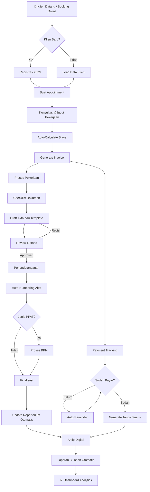

# 📋 Hasil Diskusi Panel Kepala Divisi — Kantor Notaris & PPAT

> **Tanggal Diskusi:** 1 Juni 2026  
> **Moderator:** Notaris Senior  
> **Peserta:** 5 Kepala Divisi Kantor Notaris

---

## 📌 Latar Belakang

Sebagai kantor notaris yang terus bertumbuh, kami menghadapi tantangan operasional yang semakin kompleks. Sistem manual dan semi-digital yang selama ini digunakan sudah tidak mampu mengakomodasi kebutuhan kantor. Diskusi panel ini bertujuan untuk mengidentifikasi keresahan setiap divisi dan merancang solusi web application yang komprehensif.

### Referensi Kompetitor yang Dianalisis
| Platform | Kekuatan | Kelemahan |
|----------|----------|-----------|
| **NotarisApp.id** | Google Drive integration, monitoring akta, kalkulator pajak, 337 pengguna, harga terjangkau (Rp199K-499K/bln) | Tidak ada penjadwalan, CRM terbatas, tidak ada pembukuan lengkap, tidak ada client portal |
| **Notaria.id** | Workflow akta terstruktur, proses BPN tracking, penomoran otomatis, audit trail | Tidak ada Google Drive integration, fitur keuangan terbatas |
| **eNotaris** | E-filing, monitoring pesanan | UI kurang modern, fitur terbatas |
| **AI Notaris (mesinai.net)** | Draft akta AI, standarisasi dokumen | Belum matang, fitur manajemen terbatas |

---

## 🗣️ SESI 1: Pain Points Per Divisi

### 🔵 Divisi Administrasi & Akta — Ibu Ratna

> *"Setiap bulan saya harus menyusun repertorium secara manual, mencocokkan nomor akta satu per satu. Satu kesalahan nomor, dan seluruh laporan bisa bermasalah."*

| # | Pain Point | Dampak | Urgensi |
|---|-----------|--------|---------|
| 1 | **Penomoran akta manual** — risiko salah urut, duplikasi nomor | Laporan bulanan ke Kemenkumham bermasalah | 🔴 Kritis |
| 2 | **Template akta tidak standar** — setiap staf punya versi sendiri | Inkonsistensi dokumen, revisi berulang | 🔴 Kritis |
| 3 | **Klondir fisik menumpuk** — ribuan berkas fisik sulit ditemukan | Waktu pencarian bisa 30 menit per berkas | 🟡 Tinggi |
| 4 | **Checklist dokumen tercecer** — tidak tahu kelengkapan berkas klien | Pekerjaan tertunda, klien kecewa | 🟡 Tinggi |
| 5 | **Repertorium manual** — entri data berulang, rentan human error | Audit trail tidak ada, pelaporan lambat | 🔴 Kritis |
| 6 | **Tidak ada versioning dokumen** — revisi akta sulit dilacak | Tidak tahu versi mana yang final | 🟡 Tinggi |
| 7 | **Legalisasi & waarmerking** — pencatatan masih buku tulis | Sulit dibuktikan saat ada sengketa | 🟠 Sedang |
| 8 | **Laporan bulanan Notaris & PPAT** — harus compile manual setiap bulan | 2-3 hari kerja habis untuk laporan | 🔴 Kritis |

---

### 🟢 Divisi Keuangan & Pembukuan — Pak Bambang

> *"Klien sering lupa bayar, dan kita tidak punya sistem yang otomatis mengingatkan. Invoice masih pakai Excel, kadang salah rumus, dan honorarium notaris tidak pernah konsisten."*

| # | Pain Point | Dampak | Urgensi |
|---|-----------|--------|---------|
| 1 | **Invoice manual (Excel/Word)** — format tidak konsisten, salah hitung | Unprofessional di mata klien, revenue leakage | 🔴 Kritis |
| 2 | **Piutang tidak terlacak** — tidak tahu siapa yang belum bayar | Cashflow bermasalah, piutang menumpuk | 🔴 Kritis |
| 3 | **Pajak hitung manual** — BPHTB, PPh 2.5%, PPN sering salah | Risiko denda pajak, klien komplain | 🔴 Kritis |
| 4 | **Kas masuk/keluar tanpa sistem** — petty cash tidak tercatat rapi | Tidak bisa audit, kebocoran dana | 🟡 Tinggi |
| 5 | **Honorarium tidak standar** — setiap klien ditangani berbeda | Inkonsistensi pricing, margin tidak optimal | 🟡 Tinggi |
| 6 | **Laporan keuangan lambat** — butuh 1 minggu untuk tutup buku bulanan | Notaris tidak bisa ambil keputusan finansial cepat | 🟡 Tinggi |
| 7 | **Tidak ada rekonsiliasi bank otomatis** — cek mutasi manual | Transaksi sering terlewat | 🟠 Sedang |
| 8 | **Bukti pembayaran pajak tercecer** — SSP/SSB sulit dicari | Masalah saat verifikasi BPN | 🟡 Tinggi |

---

### 🟣 Divisi Layanan Klien & Janji Temu — Ibu Sari

> *"Klien telepon atau WhatsApp untuk janji temu, kita catat di kertas atau chat. Sering bentrok jadwal, klien datang tapi notaris tidak ada. Sangat memalukan."*

| # | Pain Point | Dampak | Urgensi |
|---|-----------|--------|---------|
| 1 | **Jadwal via WA/telepon berantakan** — tidak ada sistem booking | Double booking, klien kecewa | 🔴 Kritis |
| 2 | **Klien tidak tahu progres pekerjaan** — harus telepon untuk tanya | Staf terganggu, klien frustrasi | 🔴 Kritis |
| 3 | **Follow-up terlewat** — tidak ada reminder otomatis | Klien pindah ke kantor lain | 🟡 Tinggi |
| 4 | **Tidak ada CRM** — riwayat klien tidak tercatat | Tidak bisa personalisasi layanan | 🟡 Tinggi |
| 5 | **Klien datang tanpa persiapan dokumen** — tidak diberi checklist | Appointment sia-sia, buang waktu | 🟡 Tinggi |
| 6 | **Feedback klien tidak terukur** — tidak ada survei kepuasan | Tidak tahu area improvement | 🟠 Sedang |
| 7 | **Komunikasi multi-channel tidak terintegrasi** — WA, email, telepon terpisah | Informasi tercecer, respon lambat | 🟡 Tinggi |
| 8 | **Tidak ada client portal** — klien tidak bisa upload dokumen mandiri | Bergantung pada pertemuan fisik | 🟡 Tinggi |

---

### 🔴 Divisi IT & Digital — Pak Andi

> *"Data tersebar di laptop masing-masing staf, flash drive, Google Drive pribadi. Tidak ada single source of truth. Kalau ada staf resign, data bisa hilang."*

| # | Pain Point | Dampak | Urgensi |
|---|-----------|--------|---------|
| 1 | **Data tersebar di banyak tempat** — laptop, USB, cloud pribadi | Data loss risk, duplikasi | 🔴 Kritis |
| 2 | **Keamanan minim** — tidak ada enkripsi, password sharing | Pelanggaran UU PDP, data bocor | 🔴 Kritis |
| 3 | **Tidak ada audit trail** — siapa mengubah apa, kapan | Tidak bisa trace kesalahan | 🔴 Kritis |
| 4 | **Integrasi sistem tidak ada** — setiap divisi pakai tool sendiri | Duplikasi data, inkonsistensi | 🟡 Tinggi |
| 5 | **Backup manual** — lupa backup = data hilang | Risiko bencana (kebakaran, ransomware) | 🔴 Kritis |
| 6 | **Kepatuhan UU PDP belum terpenuhi** — tidak ada consent management | Risiko hukum | 🟡 Tinggi |
| 7 | **Duplikasi data entry** — data klien diinput berkali-kali | Inefisiensi, error | 🟡 Tinggi |

---

### 🟡 Divisi SDM & Operasional — Ibu Dewi

> *"Saya tidak tahu staf mana yang overload dan mana yang underload. Pembagian tugas pakai feeling, bukan data. KPI? Kami bahkan tidak punya."*

| # | Pain Point | Dampak | Urgensi |
|---|-----------|--------|---------|
| 1 | **Beban kerja tidak merata** — beberapa staf overload, lain idle | Burnout, kualitas menurun | 🟡 Tinggi |
| 2 | **KPI sulit diukur** — tidak ada metrik kinerja | Tidak bisa evaluasi & reward | 🟡 Tinggi |
| 3 | **Absensi manual** — buku hadir, tidak ada tracking jam kerja | Manipulasi mudah | 🟠 Sedang |
| 4 | **Training tidak terstruktur** — staf baru belajar sambil jalan | Onboarding lama, error banyak | 🟠 Sedang |
| 5 | **Knowledge management buruk** — SOP di kepala orang | Kalau resign, knowledge hilang | 🟡 Tinggi |
| 6 | **Rotasi tugas sulit** — tidak tahu siapa bisa apa | Ketergantungan pada individu tertentu | 🟠 Sedang |

---

## 🔄 SESI 2: Cross-Functional Issues

Masalah-masalah yang melibatkan lebih dari satu divisi:

### Issue 1: "Silo Data" — Semua Divisi
```
Klien → [Ibu Sari catat di WA] → [Ibu Ratna catat di Excel] → [Pak Bambang catat di buku]
                                    ↓
                          3 versi data berbeda!
```
**Dampak:** Informasi klien tidak sinkron, sering terjadi miskomunikasi.

### Issue 2: "Invoice vs Progres Akta" — Keuangan × Administrasi
- Pak Bambang kirim invoice, tapi tidak tahu apakah akta sudah selesai
- Ibu Ratna selesaikan akta, tapi tidak tahu apakah klien sudah bayar
- **Dampak:** Akta diserahkan sebelum lunas, atau klien sudah bayar tapi akta tertunda

### Issue 3: "Janji Temu vs Ketersediaan" — Layanan Klien × SDM
- Ibu Sari jadwalkan meeting, tapi tidak tahu notaris ada atau tidak
- Ibu Dewi tidak punya visibility jadwal notaris
- **Dampak:** Double booking, klien datang sia-sia

### Issue 4: "Laporan vs Data Aktual" — Semua Divisi
- Laporan bulanan membutuhkan data dari semua divisi
- Pengumpulan data manual, rentan error
- **Dampak:** Laporan ke Kemenkumham/BPN terlambat dan tidak akurat

### Issue 5: "Keamanan vs Produktivitas" — IT × Semua Divisi
- Pak Andi ingin restrict akses, tapi staf butuh fleksibilitas
- Role-based access belum ada
- **Dampak:** Semua orang akses semua, atau terlalu terbatas

---

## 🏗️ SESI 3: Fitur Web App yang Dibutuhkan

### Dari Divisi Administrasi & Akta (Ibu Ratna)
1. ✅ Auto-numbering akta (Notaris & PPAT terpisah)
2. ✅ Template akta library dengan variabel dinamis
3. ✅ Digital checklist kelengkapan dokumen per jenis pekerjaan
4. ✅ Repertorium otomatis (auto-fill dari data pekerjaan)
5. ✅ Document versioning & revision history
6. ✅ Laporan bulanan auto-generate (PDF format standar)
7. ✅ Pencatatan legalisasi & waarmerking digital
8. ✅ OCR untuk scan dokumen fisik → digital

### Dari Divisi Keuangan (Pak Bambang)
1. ✅ Invoice generator otomatis (branded, profesional)
2. ✅ Accounts receivable tracking (piutang dashboard)
3. ✅ Kalkulator pajak terintegrasi (BPHTB, PPh, PPN)
4. ✅ Kas masuk/keluar dengan kategorisasi
5. ✅ Honorarium calculator sesuai UU Jabatan Notaris Pasal 36
6. ✅ Laporan keuangan otomatis (P&L, neraca sederhana)
7. ✅ Payment reminder otomatis (WhatsApp/Email)
8. ✅ Rekonsiliasi bank sederhana
9. ✅ Tanda terima digital dengan QR code

### Dari Divisi Layanan Klien (Ibu Sari)
1. ✅ Online appointment booking system
2. ✅ Client portal — klien bisa cek progres & upload dokumen
3. ✅ CRM — riwayat klien, catatan, preferensi
4. ✅ Automated follow-up & reminder (WA/Email/SMS)
5. ✅ Checklist dokumen otomatis dikirim sebelum appointment
6. ✅ Customer satisfaction survey (pasca layanan)
7. ✅ WhatsApp Business API integration
8. ✅ Waiting queue management (untuk walk-in)

### Dari Divisi IT & Digital (Pak Andi)
1. ✅ Centralized data storage (single source of truth)
2. ✅ Role-based access control (RBAC) — Notaris, Admin, Staf, Keuangan
3. ✅ Full audit trail (siapa, apa, kapan, dimana)
4. ✅ Automated backup (daily/weekly)
5. ✅ End-to-end encryption untuk data sensitif
6. ✅ Two-factor authentication (2FA)
7. ✅ UU PDP compliance module (consent management)
8. ✅ API integration layer (untuk integrasi masa depan)
9. ✅ Offline mode untuk area dengan internet terbatas

### Dari Divisi SDM & Operasional (Ibu Dewi)
1. ✅ Task assignment & workload dashboard
2. ✅ KPI tracking per staf (jumlah akta, kecepatan, error rate)
3. ✅ Digital attendance & timesheet
4. ✅ SOP library digital (knowledge base)
5. ✅ Staff skill matrix
6. ✅ Internal messaging / notification center
7. ✅ Training module tracker

---

## 🔄 SESI 4: Workflow Ideal End-to-End

### Fase 1: Penerimaan Klien
```
Klien Baru/Lama
    │
    ├── Online: Booking via Client Portal / WhatsApp Bot
    │       │
    │       ├── Sistem auto-check jadwal notaris
    │       ├── Kirim checklist dokumen yang diperlukan
    │       └── Konfirmasi appointment (WA/Email)
    │
    └── Walk-in: Registrasi di front desk
            │
            ├── Input ke CRM (cek apakah klien lama)
            └── Masuk waiting queue
```

### Fase 2: Konsultasi & Input Pekerjaan
```
Appointment / Konsultasi
    │
    ├── Notaris/Staf buka form pekerjaan baru
    │       │
    │       ├── Pilih jenis pekerjaan (AJB, Hibah, PKS, dll)
    │       ├── Auto-load checklist dokumen sesuai jenis
    │       ├── Input data pihak-pihak (auto-fill dari CRM)
    │       └── Upload dokumen pendukung (atau klien upload via portal)
    │
    ├── Auto-calculate estimasi biaya:
    │       ├── Honorarium Notaris (Pasal 36 UUJN)
    │       ├── BPHTB (5% × (NPOP - NPOPTKP))
    │       ├── PPh Final (2.5% × NPOP)
    │       └── Biaya lain-lain
    │
    └── Generate & kirim invoice ke klien
```

### Fase 3: Proses Pekerjaan
```
Pekerjaan Berjalan
    │
    ├── Status tracking real-time:
    │       │
    │       ├── 📋 Dokumen Diterima
    │       ├── ✏️  Draft Akta (dari template library)
    │       ├── 👀 Review Notaris
    │       ├── ✅ Approved / Revisi
    │       ├── 📝 Penandatanganan
    │       ├── 📄 Penomoran Akta (auto-number)
    │       ├── 📤 Proses BPN (jika PPAT)
    │       ├── 📬 Sertifikat Jadi
    │       └── 🏁 Selesai & Diserahkan
    │
    ├── Auto-update repertorium
    ├── Auto-notify klien setiap perubahan status
    ├── Assignment task ke staf (workload-balanced)
    └── Semua dokumen auto-save ke cloud storage
```

### Fase 4: Penagihan & Pembayaran
```
Pembayaran
    │
    ├── Invoice auto-generated (saat pekerjaan dimulai)
    ├── Payment reminder (H-7, H-3, H-1, H+1 overdue)
    │       │
    │       ├── Via WhatsApp
    │       ├── Via Email
    │       └── Via SMS
    │
    ├── Klien bayar → konfirmasi di sistem
    │       │
    │       ├── Upload bukti transfer
    │       ├── Auto-match dengan invoice
    │       └── Generate tanda terima (QR code)
    │
    └── Dashboard piutang real-time
```

### Fase 5: Pelaporan & Arsip
```
Akhir Bulan / Akhir Pekerjaan
    │
    ├── Laporan Bulanan Auto-Generate:
    │       ├── Laporan Notaris (Legalisasi, Akta, Waarmerking)
    │       ├── Laporan PPAT (format A3, font mesin ketik)
    │       └── Laporan Keuangan (P&L sederhana)
    │
    ├── Arsip Digital:
    │       ├── Semua dokumen tersimpan terstruktur
    │       ├── Linked ke data klien di CRM
    │       └── Searchable (full-text search)
    │
    └── KPI Report:
            ├── Produktivitas per staf
            ├── Revenue per jenis pekerjaan
            └── Customer satisfaction score
```

### Workflow Diagram (Mermaid)



---

## 🔍 SESI 5: Gap Analysis vs NotarisApp.id

Fitur yang **TIDAK dimiliki** oleh NotarisApp.id tapi **sangat dibutuhkan**:

| # | Fitur | Kebutuhan Divisi | Prioritas |
|---|-------|-----------------|-----------|
| 1 | **Online Appointment Booking** | Layanan Klien | 🔴 P0 |
| 2 | **Client Portal** (cek progres, upload dokumen) | Layanan Klien, IT | 🔴 P0 |
| 3 | **Pembukuan Keuangan Lengkap** (bukan hanya invoice) | Keuangan | 🔴 P0 |
| 4 | **CRM & Riwayat Klien** | Layanan Klien | 🔴 P0 |
| 5 | **WhatsApp Business API Integration** | Layanan Klien, Keuangan | 🟡 P1 |
| 6 | **Template Akta Library** (dengan variabel dinamis) | Administrasi | 🟡 P1 |
| 7 | **Task Management & Workload Balancing** | SDM | 🟡 P1 |
| 8 | **Full Audit Trail** | IT | 🔴 P0 |
| 9 | **KPI & Staff Performance Dashboard** | SDM | 🟡 P1 |
| 10 | **Offline Mode** | IT | 🟢 P2 |
| 11 | **Customer Satisfaction Survey** | Layanan Klien | 🟢 P2 |
| 12 | **AI-Assisted Draft Generation** | Administrasi | 🟢 P2 |

---

## 📊 SESI 6: Prioritas Fitur

### 🔴 P0 — Must Have (MVP / Fase 1-2)
1. Dashboard utama dengan overview kantor
2. Manajemen pekerjaan (Notaris & PPAT terpisah)
3. Auto-numbering akta & repertorium
4. Checklist dokumen per jenis pekerjaan
5. Invoice generator & payment tracking
6. Kalkulator pajak (BPHTB, PPh, PPN)
7. CRM & database klien
8. Online appointment booking
9. Laporan bulanan otomatis (Notaris & PPAT)
10. Role-based access control (RBAC)
11. Audit trail
12. Cloud storage integration
13. Client portal (status tracking)
14. Kas masuk/keluar (pembukuan dasar)

### 🟡 P1 — Should Have (Fase 3)
1. WhatsApp Business API integration
2. Template akta library
3. Task assignment & workload dashboard
4. KPI tracking per staf
5. Payment reminder otomatis
6. Document versioning
7. Smart search (full-text)
8. Ekspor Excel & PDF
9. Honorarium calculator (Pasal 36)
10. Tanda terima digital (QR code)
11. Pencatatan legalisasi & waarmerking
12. Proses BPN tracking

### 🟢 P2 — Nice to Have (Fase 4+)
1. AI-assisted draft generation
2. OCR scan dokumen
3. Offline mode
4. Customer satisfaction survey
5. Digital attendance & timesheet
6. SOP library / knowledge base
7. Rekonsiliasi bank otomatis
8. Internal messaging system
9. Training module tracker
10. Waiting queue management
11. Multi-branch support (jika lebih dari 1 kantor)

---

## 📝 Catatan Penutup Diskusi

> **Ibu Ratna (Administrasi):** *"Yang penting sistem ini harus memudahkan, bukan menambah pekerjaan. Kalau inputnya lebih ribet dari yang sekarang, staf pasti menolak."*

> **Pak Bambang (Keuangan):** *"Saya butuh satu dashboard dimana saya bisa lihat: siapa yang belum bayar, berapa total piutang, dan berapa pendapatan bulan ini. Itu saja sudah sangat membantu."*

> **Ibu Sari (Layanan Klien):** *"Klien zaman sekarang mau segalanya instan. Mereka mau booking online, cek progres dari HP, dan dapat notifikasi otomatis. Kalau kita tidak sediakan, mereka pindah ke notaris yang lebih modern."*

> **Pak Andi (IT):** *"Keamanan data bukan opsional. Dengan UU PDP yang sudah berlaku, kita bisa kena sanksi kalau data klien bocor. Sistem harus compliant dari hari pertama."*

> **Ibu Dewi (SDM):** *"Saya ingin bisa melihat siapa staf yang paling produktif, siapa yang butuh training, dan bagaimana distribusi kerja. Tanpa data, saya hanya bisa menebak."*

---

*Dokumen ini adalah hasil diskusi internal dan menjadi dasar untuk penyusunan plan.md (rencana implementasi) dan goal.md (target & milestone).*
